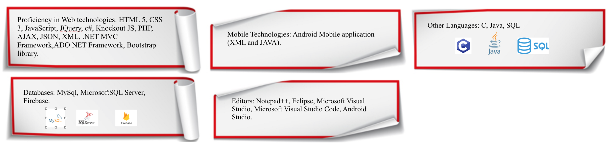

# Hi, I'm Sirine 💻

Born and raised in Lebanon, I speak three languages fluently.

Graduating with a degree in Computer Science at the American University of Beirut (AUB) in 2017 has enabled me to acquire a rich programming skill-set.

During the past 5 to 6 years, I got the oppurtunity to work in three different countries Lebanon, Dubai and Irvine and create different web and report projects for three different companies, hospital, retail and univeristy and using different modern and old technologies.

When I'm not coding I play tennis, practice Ice Skating, go rock climbing and I'm currently trying to achieve my life goal of travelling the world!

# Skills

 
